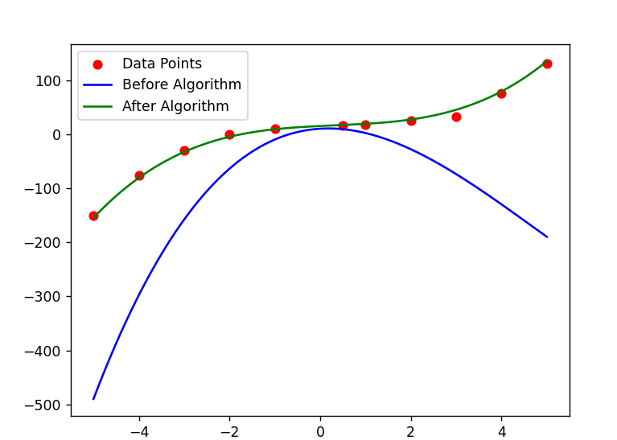

# Genetic Algorithm Optimization

This program implements a genetic algorithm for optimizing a function used to fit a curve to data. The program demonstrates how a genetic algorithm utilizes selection, crossover, and mutation to optimize a solution to a problem. Genetic algorithms show effectiveness in optimizing problems where traditional methods may not be efficient. Their flexibility and ability to explore solution spaces make them a powerful tool in various applications.

## Program Overview:

1. Chromosome Decoding:
   Chromosomes represent potential problem solutions and are encoded as binary sequences. The `decode` function transforms these sequences into function coefficient values.

2. Fitness Function:
   Used to assess the quality of a chromosome. It is the sum of squared differences between the predicted values by the function and the actual data values.

3. Input and Output Data:
   The program uses data representing different test cases. Input data consists of combinations of points, and output data consists of expected fits.

4. Population Initialization:
   The initial population of chromosomes is generated randomly, where each chromosome represents a potential solution.

5. Algorithm Parameters:

   - `mutation_rate`: Determines the probability of chromosome mutation.
   - `crossover_rate`: Determines the probability of crossover between two chromosomes.
   - `N`: Number of chromosomes in the population.
   - `stagnation_limit`: Maximum number of iterations without improvement, after which the algorithm is halted.

6. Roulette Wheel Selection:
   Selects chromosomes for reproduction based on their fitness. Chromosomes with better fitness have higher chances of being chosen.

7. Crossover and Mutation:

   - Crossover involves merging segments of two chromosomes to create new chromosomes.
   - Mutation introduces random changes in a chromosome, increasing the genetic diversity of the population.

8. Learning Process:
   The algorithm iteratively improves the population through selection, crossover, and mutation, aiming to find the chromosome with the lowest fitness value.

9. Results Visualization:
   The program displays results graphically, showing the fitting of the function to the data before and after applying the genetic algorithm.
