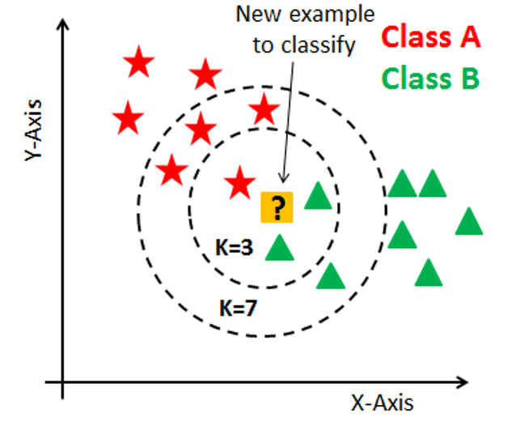

# Breast Cancer Classification using K-Nearest Neighbors (KNN)

## Overview

This program utilizes the K-Nearest Neighbors (KNN) algorithm for classifying breast cancer cases as malignant or benign. The KNN algorithm is chosen for its simplicity and effectiveness in classifying datasets where feature relationships play a crucial role in prediction.

## Algorithm Description

The K-Nearest Neighbors (KNN) algorithm is a straightforward machine learning approach used for classification. It identifies the k closest neighbors to a given data point in feature space and assigns the point to the class that is most prevalent among these neighbors.

## Program Objectives

The program aims to achieve the following objectives:

1. **Modeling Feature- Diagnosis Relationship**: Establishing the relationship between various features and the diagnosis of breast cancer (malignant or benign).

2. **Evaluating Model Effectiveness**: Assessing the model's effectiveness in predicting diagnoses based on test data.

## Input Data

The program operates on a dataset that contains a variety of breast cancer features, such as tumor radius, texture, perimeter, and area, along with labels (target) indicating whether the cancer is malignant (0) or benign (1). The dataset is sourced from the [Wisconsin Breast Cancer - 569 dataset](https://archive.ics.uci.edu/dataset/17/breast+cancer+wisconsin+diagnostic).

## Key Steps

1. **Data Standardization**: Standardizing the data is crucial as KNN relies on distance calculations between data points. Standardization transforms the data to have a mean of 0 and a standard deviation of 1, making different features comparable.

2. **Data Splitting**: The dataset is randomly split into training and validation sets. This ensures that the model is tested on previously unseen data to assess its generalization capability.

   - Training Data Size: (455)
   - Validation Data Size: (114)

3. **Choosing the Optimal k Parameter**: The program tests the model with different values of k (number of neighbors) and selects the one that yields the highest accuracy on the validation set.

   - Classifier Accuracy with the Best k: 0.974
   - Best k: 4

4. **Model Evaluation**: The model is evaluated on the validation set to understand how well it performs predictions on new data. The evaluation computes the model's accuracy by comparing predicted labels with actual labels in the validation set.

## Program Overview

1. **Importing Libraries**: The program starts by importing necessary libraries for data processing, model training, and result visualization.

2. **Loading and Data Analysis**: Data is loaded, and preliminary data analysis is performed.

3. **Data Normalization**: Feature standardization is conducted, a crucial step in preparing data for use in the KNN algorithm.

4. **Data Splitting**: Data is split into training and validation sets.

5. **KNN Classifier Training and Evaluation**: The KNN model is trained and evaluated for accuracy.

6. **Optimization of the k Parameter**: Parameter k is optimized to find the most efficient value for the model.

7. **Final Evaluation and Prediction**: The model with the best k value is re-evaluated and used to make predictions on selected data samples.

## Program Outcome

The program's outcome is the development of a breast cancer classification model using the KNN algorithm and an evaluation of its performance on unseen validation data.
